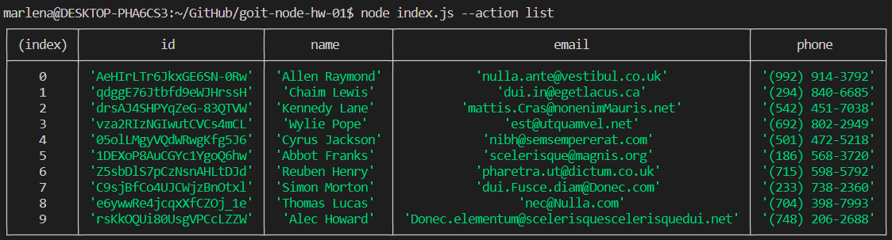
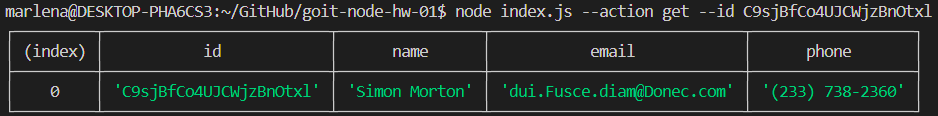
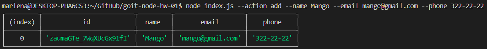
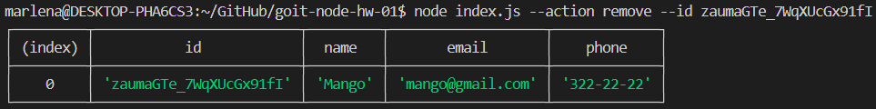

CLI application designed to manage contacts. The application allows users to perform various actions such as listing all contacts, retrieving contacts by ID, adding new contacts, and removing existing contacts.

### Getting Started

Make sure you have Node.js installed  
npm install  
npm start  
npm run start:dev  

## We receive and display the entire list of contacts in a table format (console.table).

`node index.js --action list`

## We retrieve a contact by ID.

`node index.js --action get --id 05olLMgyVQdWRwgKfg5J6`

## We add a contact.

`node index.js --action add --name Mango --email mango@gmail.com --phone 322-22-22`

## We delete a contact.

`node index.js --action remove --id qdggE76Jtbfd9eWJHrssH`

